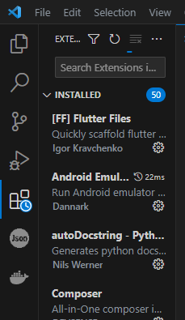

| Nama      | Faris Syahluthfi |
| ----------- | ----------- |
| NIM     | 312010034       |
| Kelas   | TI.20.A.1        |

</p>

## Membuat Tampilan Login, Registrasi dan Lupa Password Menggunakan Flutter Dart. </p></br>
# 1. Download Flutter</p>
<li> Download SDK Flutternya di: https://docs.flutter.dev/get-started/install . </li> </p>
<li> Pilih operasi sistem sesuai laptop atau PC kalian, disini saya pake sistem operasi windows. Jadi saya download Flutternya Windows.</li></p> </br>

# 2. Installasi Flutter di Windows

<li> Ekstak file Flutter yang sudah di download. Caranya adalah klik kanan, pilih ekstak here, setelah itu tunggu sampai ekstak selesai. </li><p>
<li> Pindahkan file Flutter yang sudah di ekstak ke dalam disk C atau disk D. Disini saya memindahkannya ke disk C.

</li></p>

<li> Pilih menu pencarian di bawah. contoh environment di windows:

</li></p>
<li> pilih environment variable

</li></p>

<li> pilih path

</li></p>

<li> new lalu arahkan ke file flutternya

</li></p></br>

# 3. Membuat Projek Aplikasinya </br>

<li> Kita akan membuat program aplikasinya di Visual Studio Code. Buka aplikasi Visual Studio Code

</li></p></br>

<li> Pilih menu <b> Ekstensions </b> sebelah kiri untuk menginstal <b> FLUTTER dan DART </b>

</li></p></br>

</li></p></br>

</li></p></br>

<li> Klik fn+f2 untuk membuat folder baru flutter

</li></p></br>

<li> inilah penampakannya jika kalian berhasil

</li></p></br>

# 4. Membuat Screen Login Flutter Dart </p></br>
<li> Buat folder baru <b>assets</b>, kemudian cari background untuk Login dan Register.</li></p></br>

</li></p></br>

<li> Buka file <b> pubspec.yaml </b> Lalu buat code berikut:

</li></p></br>

```java
flutter:
  assets:
    - assets/login.jpg
    - assets/register.jpg

```
 </li></p></br>
Penjelasan codingan: Fungsi code diatas adalah untuk menampilkan gambar atau background kedalam flutter. </li></p></br>

<li> Di folder <b>lib<b>, Buat file baru dengan nama <b>login.dart<b>, Kemudian isikan codingan berikut:

```java

import 'package:flutter/material.dart';

class MyLogin extends StatefulWidget {
  const MyLogin({Key? key}) : super(key: key);

  @override
  _MyLoginState createState() => _MyLoginState();
}

class _MyLoginState extends State<MyLogin> {
  //Password Field obscureText  Handler
  bool _isHidden = true;
  void _toggleVisibility() {
    setState(() {
      _isHidden = !_isHidden;
    });
  }

  @override
  Widget build(BuildContext context) {
    return SafeArea(
      child: Container(
        decoration: BoxDecoration(
          image: DecorationImage(
            image: AssetImage(
              'assets/login.jpg',
            ),
            fit: BoxFit.cover,
          ),
        ),
        child: Scaffold(
          backgroundColor: Color.fromARGB(0, 0, 0, 0),
          body: Stack(
            children: [
              Row(
                mainAxisAlignment: MainAxisAlignment.center,
                children: [
                  Container(
                    padding: EdgeInsets.only(
                      top: 50.0,
                    ),
                    child: Text(
                      '\n LOGIN',
                      textAlign: TextAlign.left,
                      style: TextStyle(
                        color: Color.fromARGB(255, 233, 231, 231),
                        fontSize: 55.0,
                      ),
                    ),
                  ),
                ],
              ),
              SingleChildScrollView(
                child: Container(
                  padding: EdgeInsets.only(
                    top: MediaQuery.of(context).size.height * 0.5,
                    left: 35,
                    right: 35,
                  ),
                  child: Column(
                    children: [
                      TextField(
                        decoration: InputDecoration(
                          labelText: 'Email',
                          prefixIcon: Icon(Icons.email_outlined),
                          fillColor: Color.fromARGB(234, 237, 251, 253),
                          filled: true,
                          border: OutlineInputBorder(
                            borderRadius: BorderRadius.circular(10.0),
                          ),
                        ),
                      ),
                      SizedBox(height: 30.0),
                      TextFormField(
                        validator: (value) {
                          if (value == null || value.isEmpty) {
                            return 'Please enter the password';
                          } else if (value.length <= 6) {
                            return 'Password must be greater than 6 digits';
                          }
                          return null;
                        },
                        obscureText: true,
                        decoration: InputDecoration(
                          labelText: 'Password',
                          fillColor: Color.fromARGB(234, 237, 251, 253),
                          prefixIcon: Icon(Icons.lock),
                          suffixIcon: IconButton(
                            onPressed: _toggleVisibility,
                            icon: _isHidden
                                ? Icon(Icons.visibility)
                                : Icon(Icons.visibility_off),
                          ),
                          filled: true,
                          // hintText: 'Password',
                          border: OutlineInputBorder(
                            borderRadius: BorderRadius.circular(10.0),
                          ),
                        ),
                      ),
                      SizedBox(height: 30.0),
                      Row(
                        mainAxisAlignment: MainAxisAlignment.end,
                        children: [
                          ElevatedButton(
                              style: ElevatedButton.styleFrom(
                                maximumSize: Size(170.0, 90.0),
                                minimumSize: Size(170.0, 60.0),
                                primary: Color.fromARGB(255, 180, 21, 9),
                                shape: StadiumBorder(),
                              ),
                              onPressed: () {},
                              child: Row(
                                mainAxisAlignment:
                                    MainAxisAlignment.spaceBetween,
                                //crossAxisAlignment: CrossAxisAlignment.center,
                                children: [
                                  Text('LOG IN'),
                                  Icon(
                                    Icons.lock,
                                    color: Colors.white,
                                  ),
                                ],
                              )),
                        ],
                      ),
                      SizedBox(height: 35.0),
                      Row(
                        mainAxisAlignment: MainAxisAlignment.spaceBetween,
                        children: [
                          TextButton(
                            onPressed: () {
                              Navigator.pushNamed(context, 'register');
                            },
                            child: Text(
                              'Create an Account',
                              style: TextStyle(
                                  color: Color.fromARGB(255, 180, 21, 9),
                                  fontSize: 17,
                                  fontWeight: FontWeight.bold,
                                  decorationThickness: 2),
                            ),
                          ),
                          TextButton(
                            onPressed: () {
                              Navigator.pushNamed(context, 'forgot');
                            },
                            child: Text(
                              'Forgot Password?',
                              style: TextStyle(
                                  color: const Color.fromARGB(255, 180, 21, 9),
                                  fontSize: 17,
                                  fontWeight: FontWeight.bold,
                                  decorationThickness: 2),
                            ),
                          ),
                        ],
                      ),
                    ],
                  ),
                ),
              ),
            ],
          ),
        ),
      ),
    );
  }
}


```
</li></p></br>
Penjelasan dari codingan di atas:</p>
1. import 'package:flutter/material.dart';: Mengimpor package flutter/material.dart, yang berisi kelas-kelas yang digunakan untuk membangun antarmuka pengguna (UI) dengan menggunakan framework Flutter. </p>
2. import 'package:flutter_application_1/login.dart';: Mengimpor file login.dart yang berisi kode untuk halaman login. </p>
3. import 'package:flutter_application_1/register.dart';: Mengimpor file register.dart yang berisi kode untuk halaman registrasi.</p>
4. import 'package:flutter_application_1/resetpass.dart';: Mengimpor file resetpass.dart yang berisi kode untuk halaman reset password.</p>
5. void main() { ... }: Ini adalah fungsi utama yang akan dijalankan saat aplikasi dijalankan. Fungsi ini akan menjalankan aplikasi Flutter.</p>
6. runApp(...);: Metode runApp adalah metode yang digunakan untuk menjalankan aplikasi Flutter. Di dalamnya, kita memberikan MaterialApp sebagai widget utama.</p>
7. MaterialApp: Ini adalah widget yang membangun dan mengkonfigurasi aplikasi Flutter. Widget ini memiliki beberapa properti seperti debugShowCheckedModeBanner, initialRoute, title, dan routes.</p>
8. debugShowCheckedModeBanner: false,: Properti ini digunakan untuk menghilangkan tanda "Debug" pada aplikasi.</p>
9. initialRoute: 'login',: Properti ini menentukan rute awal aplikasi, dalam hal ini adalah halaman login.</p>
10. title: 'LOGIN',: Properti ini digunakan untuk memberikan judul pada aplikasi.</p>
11. routes: { ... }: Properti ini digunakan untuk mendefinisikan rute-rute yang ada dalam aplikasi. Setiap rute memiliki nama yang unik dan dihubungkan dengan widget yang akan ditampilkan.</p>
12. 'login': (context) => MyLogin(),: Ini adalah definisi rute untuk halaman login. Ketika rute ini dipanggil, widget MyLogin akan ditampilkan.</p>
13. 'register': (context) => myRegister(),: Ini adalah definisi rute untuk halaman registrasi. Ketika rute ini dipanggil, widget myRegister akan ditampilkan.</p>
14. 'forgot': (context) => resetPassword(),: Ini adalah definisi rute untuk halaman reset password. Ketika rute ini dipanggil, widget resetPassword akan ditampilkan.</p>

<li>Selanjutnya, buka file <b>main.dart</b> hapus semua codingannya, lalu ketik kodingan baru berikut ini:</p></br>

```java

import 'package:flutter/material.dart'; 
import 'package:flutter_application_1/login.dart';
import 'package:flutter_application_1/register.dart';
import 'package:flutter_application_1/resetpass.dart';

void main() {
  runApp(
    MaterialApp(
      debugShowCheckedModeBanner: false,
      initialRoute: 'login',
      title: 'LOGIN',
      routes: {
        'login': (context) => MyLogin(),
        'register': (context) => myRegister(),
        'forgot': (context) => resetPassword(),
      },
    ),
  );
}


```
</p></br>

Penjelasan codingan di atas: </p>
1.`import 'package:flutter/material.dart';`: Mengimpor package `flutter/material.dart`, yang berisi kelas-kelas yang diperlukan untuk membangun antarmuka pengguna (UI) menggunakan framework Flutter.</p>

2.`import 'package:flutter_application_1/login.dart';`: Mengimpor file `login.dart` yang berisi kode untuk halaman login. File ini kemungkinan berisi definisi dari kelas `MyLogin` yang merupakan widget untuk tampilan halaman login.</p>

3.`import 'package:flutter_application_1/register.dart';`: Mengimpor file `register.dart` yang berisi kode untuk halaman registrasi. File ini kemungkinan berisi definisi dari kelas `myRegister` yang merupakan widget untuk tampilan halaman registrasi.</p>

4.`import 'package:flutter_application_1/resetpass.dart';`: Mengimpor file `resetpass.dart` yang berisi kode untuk halaman reset password. File ini kemungkinan berisi definisi dari kelas `resetPassword` yang merupakan widget untuk tampilan halaman reset password.</p>

5.`void main() { ... }`: Ini adalah fungsi utama yang akan dijalankan saat aplikasi dijalankan. Fungsi ini akan menjalankan aplikasi Flutter.</p>

6.`runApp(...);`: Metode `runApp` digunakan untuk menjalankan aplikasi Flutter. Di dalamnya, kita memberikan `MaterialApp` sebagai widget utama.</p>

7.`MaterialApp`: Ini adalah widget yang membangun dan mengkonfigurasi aplikasi Flutter. Widget ini memiliki beberapa properti seperti `debugShowCheckedModeBanner`, `initialRoute`, `title`, dan `routes`.</p>

8.`debugShowCheckedModeBanner: false,`: Properti ini digunakan untuk menghilangkan tanda "Debug" pada aplikasi.</p>

9.`initialRoute: 'login',`: Properti ini menentukan rute awal aplikasi, dalam hal ini adalah halaman login.</p>

10.`title: 'LOGIN',`: Properti ini digunakan untuk memberikan judul pada aplikasi.</p>

11.`routes: { ... }`: Properti ini digunakan untuk mendefinisikan rute-rute yang ada dalam aplikasi. Setiap rute memiliki nama yang unik dan dihubungkan dengan widget yang akan ditampilkan.</p>

12.`'login': (context) => MyLogin(),`: Ini adalah definisi rute untuk halaman login. Ketika rute ini dipanggil, widget `MyLogin` akan ditampilkan.</p>

13.`'register': (context) => myRegister(),`: Ini adalah definisi rute untuk halaman registrasi. Ketika rute ini dipanggil, widget `myRegister` akan ditampilkan.</p>

14.`'forgot': (context) => resetPassword(),`: Ini adalah definisi rute untuk halaman reset password. Ketika rute ini dipanggil, widget `resetPassword` akan ditampilkan.</p></br>


